## Project Overview
This project is a production-grade, highly scalable RESTful backend system for an e-commerce platform. It manages the complete online shopping lifecycle, including user authentication, product catalog management, shopping cart operations, order processing, and simulated payment handling.

Built with **Java 17** and **Spring Boot 4.0.3**, the system adheres to an industry-standard Controller-Service-Repository architecture. It incorporates advanced enterprise patterns such as JWT-based stateless security, Redis caching for optimized inventory reads, asynchronous email notifications, and strict data integrity using Optimistic Locking.

---


## Table of Contents
- [Project Overview](#project-overview)
- [Folder Structure](#folder-structure)
- [Technologies and Libraries Used](#technologies-and-libraries-used)
- [How to Execute the Project Locally](#how-to-execute-the-project-locally)
- [Running the Application](#running-the-application)
- [Application Architecture (Spring MVC)](#application-architecture-spring-mvc)
- [Database Schema](#database-schema)
- [Entity Relationship Diagram (ERD)](#entity-relationship-diagram-erd)
- [API Documentation](#api-documentation)
- [API Documentation & Testing Guide](#api-documentation-testing-guide)
- [Testing the API (Using Postman)](#testing-the-api-using-postman)
- [Additional Features & Optimizations](#additional-features-optimizations)
- [Global Exception Handling (@RestControllerAdvice)](#global-exception-handling-restcontrolleradvice)
- [Testing & Code Coverage](#testing-code-coverage)

## 📂 Folder Structure

The project follows a clean, layered architectural pattern, separating concerns for maintainability and scalability. It also includes comprehensive testing and reporting directories.

```text
ecommerce-backend/
├── src/
│   ├── main/
│   │   ├── java/com/ecommerce/
│   │   │   ├── config/          # Application configuration
│   │   │   ├── controller/      # REST API controllers
│   │   │   ├── dto/             # Data Transfer Objects
│   │   │   ├── entity/          # JPA Entities
│   │   │   ├── exception/       # Custom exceptions
│   │   │   ├── filter/          # JWT authentication filters
│   │   │   ├── repository/      # Spring Data JPA repositories
│   │   │   ├── service/         # Service interfaces
│   │   │   ├── serviceImpl/     # Business logic implementations
│   │   │   └── utils/           # Utility/helper classes
│   │   └── resources/           # application.properties
│   │
│   └── test/
│       └── java/com/ecommerce/  # Unit tests using JUnit & Mockito
│
├── images/                      # Screenshots, ER diagrams, and UI assets
├── logs/                        # Application runtime logs
├── target/                      # Compiled files and build artifacts
├── pom.xml                      # Maven dependencies
└── README.md                    # Project documentation                 
```

---

## Technologies and Libraries Used
```text

| Component        | Technology                     | Version       | Purpose |
|------------------|--------------------------------|---------------|---------|
| Language         | Java                           | 17+           | Core programming language providing modern features and long-term support |
| Framework        | Spring Boot                    | 3.2.x         | Rapid development framework used to build RESTful backend APIs |
| ORM              | Spring Data JPA / Hibernate    | 3.x           | Object-Relational Mapping for seamless interaction with the database |
| Database         | MySQL                          | 8.x           | Primary relational database for persistent transactional data storage |
| Caching          | Redis                          | 7.x           | In-memory data store used for fast inventory checks and caching |
| Security         | Spring Security & JWT          | 6.x / 0.11.5  | Role-Based Access Control and stateless authentication using tokens |
| Object Mapping   | ModelMapper                    | 3.1.1         | Converts entities to DTOs and simplifies API responses |
| Async Processing | Spring Boot Mail               | 3.x           | Sends order confirmation emails asynchronously |
| Testing          | JUnit 5 & Mockito              | 5.x           | Used for unit testing and mocking dependencies |
| Test Coverage    | JaCoCo                         | 0.8.x         | Generates detailed test coverage reports |
| Logging          | SLF4J / Logback                | N/A           | Standardized application logging for debugging and monitoring |
| API Documentation| Swagger UI (OpenAPI)           | 2.7.0          | Interactive API documentation and testing interface |

```
---

# How to Execute the Project Locally

## 1️⃣ Required Dependencies (pom.xml)

Ensure your `pom.xml` contains these core starters:

- spring-boot-starter-web  


- spring-boot-starter-data-jpa  


- spring-boot-starter-security  


- spring-boot-starter-data-redis  


- spring-boot-starter-mail  


- spring-boot-starter-validation  


- mysql-connector-j  


- jjwt-api, jjwt-impl, jjwt-jackson

  
- modelmapper  


- springdoc-openapi-starter-webmvc-ui (Swagger)


- springdoc-openapi-starter-webmvc-ui: For Swagger documentation (v2.7.0).

---

## 2️⃣ Setting Up Redis (Windows Native)

We use Redis to optimize product queries and inventory management.

1. Download and extract the [Redis for Windows zip file](https://github.com/microsoftarchive/redis/releases).

  
2. Open the Command Prompt (cmd)  


3. Navigate to the extracted Redis folder 

 
4. Run the Redis server executable:


```bash
redis-server.exe
```

Leave this CMD window open while running the Spring Boot application.

---

## 3️⃣ Application Configuration

Update `src/main/resources/application.properties` with your database and Redis details:

```properties
spring.datasource.url=jdbc:mysql://localhost:3306/ecommerce_db?createDatabaseIfNotExist=true
spring.datasource.username=root
spring.datasource.password=yourpassword
spring.jpa.hibernate.ddl-auto=update

spring.data.redis.host=localhost
spring.data.redis.port=6379

jwt.secret=YOUR_SUPER_SECRET_KEY_MUST_BE_LONG_ENOUGH
jwt.expiration=86400000

# Email Configuration
spring.mail.host=smtp.gmail.com
spring.mail.port=587
spring.mail.username=your-email@gmail.com
spring.mail.password=your-app-password


# Sort endpoints alphabetically by their tag name (follows your 1, 2, 3 numbering)
springdoc.swagger-ui.tags-sorter=alpha

# Sort operations (GET, POST, etc.) within each tag alphabetically
springdoc.swagger-ui.operations-sorter=alpha

# Enable the 'Try it out' button by default
springdoc.swagger-ui.try-it-out-enabled=true

# Show the duration it took for the API to respond
springdoc.swagger-ui.display-request-duration=true

# Filter endpoints directly in the UI
springdoc.swagger-ui.filter=true
```

---

# ▶ Running the Application

After completing the configuration steps above, the project can be started using either **Maven** or directly from an **IDE**.

## 1️⃣ Run Using Maven (Command Line)

Open a terminal in the **project root directory** and execute:

```bash
mvn spring-boot:run
```

This will build the project and start the Spring Boot application on:

```text
http://localhost:8080
```

---

## 2️⃣ Run Using IDE (Eclipse / IntelliJ)

### 1. Clone the Repository

First, clone the project from GitHub to your local machine.

```bash
git clone https://github.com/aditya2004-blip/ecommerce-backend.git
cd ecommerce-backend
```

#### Database Configuration

DB_URL=jdbc:mysql://localhost:3306/ecommerce_db
DB_USERNAME=root
DB_PASSWORD=your_mysql_password

##### JWT Security

JWT_SECRET=your_super_secret_key_at_least_64_characters_long
JWT_EXPIRATION=86400000

#### Redis Configuration
REDIS_HOST=localhost
REDIS_PORT=6379

#### Email Service
MAIL_USERNAME=your_email@gmail.com


MAIL_PASSWORD=your_gmail_app_password

---

## Application Architecture (Spring MVC)

This project follows the **Spring MVC layered architecture**, which separates responsibilities across multiple layers to ensure clean code, scalability, and maintainability.

<p align="center">
  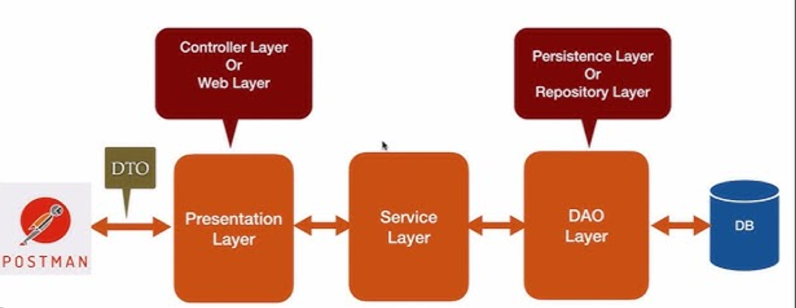
</p>

# Application Architecture Flow

The system follows a layered architecture based on the **Spring MVC pattern**, ensuring clear separation of concerns between request handling, business logic, and data persistence.

---

## 1. Client / API Testing Tool (Postman)

**Role:**  
The entry point of the request lifecycle.

**Responsibilities**

- Acts as the consumer of the RESTful services.
- Initiates communication by sending HTTP requests:
  - `GET`
  - `POST`
  - `PUT`
  - `DELETE`
- Requests contain:
  - JSON payloads
  - HTTP headers (such as **JWT Bearer Token**)

**Components**

- Front-end web applications
- Mobile applications
- API testing tools such as **Postman** and **Insomnia**

---

## 2. Controller Layer (Presentation Layer)

**Role:**  
Acts as the interface between external clients and the application's internal logic.

**Responsibilities**

- Exposes REST endpoints using `@RestController`
- Maps endpoints using `@RequestMapping`
- Handles request parameters using:
  - `@PathVariable`
  - `@RequestParam`
  - `@RequestBody`
- Performs validation using `@Valid`
- Returns appropriate HTTP response codes such as:
  - `200 OK`
  - `201 Created`
  - `404 Not Found`

**Components**

- `ProductController`
- `AuthController`
- `OrderController`
- `UserController`
- `CartController`

---

## 3. DTO Layer (Data Transfer Objects)

**Role:**  
Acts as a secure data wrapper for communication between layers.

**Responsibilities**

- Decouples the API contract from the internal database schema.
- Prevents exposure of sensitive data such as hashed passwords.
- Aggregates data from multiple entities into simplified JSON responses.

**Components**

- `UserDto`
- `ProductDto`
- `OrderDto`
- `CartDto`
- `LoginDto`

---

## 4. Service Layer (Business Logic Layer)

**Role:**  
The core processing engine of the application.

**Responsibilities**

- Implements business logic such as:
  - Inventory deduction
  - Cart total calculations
  - Role-based access checks
- Manages transactions using `@Transactional`
- Coordinates interactions between repositories and external services
- Integrates additional services such as:
  - Redis for caching inventory
  - SMTP for email notifications

**Components**

- `AuthServiceImpl`
- `ProductServiceImpl`
- `CartServiceImpl`
- `OrderServiceImpl`
- `RedisInventoryServiceImpl`

---

## 5. Repository Layer (Persistence Layer / DAO)

**Role:**  
Provides abstraction for all database operations.

**Responsibilities**

- Implements CRUD operations using **Spring Data JPA**
- Defines derived queries such as:
  - `findByEmail`
- Communicates with the database using **Hibernate ORM**

**Components**

- `UserRepository`
- `ProductRepository`
- `CartRepository`
- `OrderRepository`

---

## 6. Database Layer

**Role:**  
Persistent storage layer for application data.

**Responsibilities**

- Stores relational data with referential integrity
- Maintains relationships using **Foreign Keys**
- Ensures safe concurrent updates using **Optimistic Locking (`@Version`)**

**Components**

- **MySQL 8.x Database**
- **Hibernate ORM**


## Database Schema

The application uses a **relational database design (MySQL)** to manage users, products, carts, and orders.  
The schema ensures **data integrity, optimized queries, and transactional consistency**.

---

### Tables Overview

<table>
<tr>
<th width="200">Table</th>
<th width="600">Description</th>
</tr>

<tr>
<td><b>User</b></td>
<td>Stores user account information and roles</td>
</tr>

<tr>
<td><b>Product</b></td>
<td>Contains product catalog data</td>
</tr>

<tr>
<td><b>Cart</b></td>
<td>Represents a user's active shopping cart</td>
</tr>

<tr>
<td><b>CartItem</b></td>
<td>Stores items added to the shopping cart</td>
</tr>

<tr>
<td><b>Order</b></td>
<td>Represents a completed purchase transaction</td>
</tr>

<tr>
<td><b>OrderItem</b></td>
<td>Stores individual items belonging to an order</td>
</tr>

</table>

## Table Structure

### 1️⃣ User Table

```text
| Column   | Type                   | Description                    |
|----------|------------------------|--------------------------------|
| id       | PK                     | Unique user identifier         |
| name     | VARCHAR                | User full name                 |
| email    | VARCHAR (Unique)       | User login email               |
| password | VARCHAR                | Hashed password                |
| role     | ENUM (ADMIN, CUSTOMER) | Defines user access level      |
---
```

### 2️⃣ Product Table

```text
| Column      | Type        | Description                         |
|-------------|-------------|-------------------------------------|
| id          | PK          | Unique product identifier           |
| name        | VARCHAR     | Product name                        |
| description | TEXT        | Product details                     |
| price       | BigDecimal  | Product price                       |
| stock       | INT         | Available inventory                 |
| category    | VARCHAR     | Product category                    |
| image_url   | VARCHAR     | Product image location              |
| rating      | DOUBLE      | Product rating                      |
| version     | INT         | Used for optimistic locking control |
---
```
### 3️⃣ Cart Table

```text
| Column      | Type       | Description                        |
|-------------|------------|------------------------------------|
| id          | PK         | Cart identifier                    |
| user_id     | FK         | References User table              |
| total_price | BigDecimal | Total price of items in the cart   |

**Relationship**

User **1 → 1** Cart

---
```

### 4️⃣ CartItem Table

```text
| Column     | Type       | Description                        |
|------------|------------|------------------------------------|
| id         | PK         | Cart item identifier               |
| cart_id    | FK         | References Cart                    |
| product_id | FK         | References Product                 |
| quantity   | INT        | Number of items                    |
| price      | BigDecimal | Product price snapshot at purchase |

**Relationship**

Cart **1 → N** CartItems

---
```

### 5️⃣ Order Table

```text
| Column         | Type                                   | Description                     |
|----------------|----------------------------------------|---------------------------------|
| id             | PK                                     | Order identifier                |
| user_id        | FK                                     | References User                 |
| total_amount   | BigDecimal                             | Total order amount              |
| order_date     | TIMESTAMP                              | Order creation time             |
| payment_status | ENUM (PENDING, SUCCESS, FAILED)        | Payment result                  |
| order_status   | ENUM (PLACED, SHIPPED, DELIVERED, CANCELLED) | Order lifecycle state     |

**Relationship**

User **1 → N** Orders

---
```

### 6️⃣ OrderItem Table

```text
| Column     | Type       | Description                         |
|------------|------------|-------------------------------------|
| id         | PK         | Order item identifier               |
| order_id   | FK         | References Order                    |
| product_id | FK         | References Product                  |
| quantity   | INT        | Number of items ordered             |
| price      | BigDecimal | Product price snapshot at purchase  |

**Relationship**

Order **1 → N** OrderItems

---
```


## Entity Relationship Diagram (ERD)

The following diagram represents the **database relationships between all entities** used in the system.

<p align="center">
  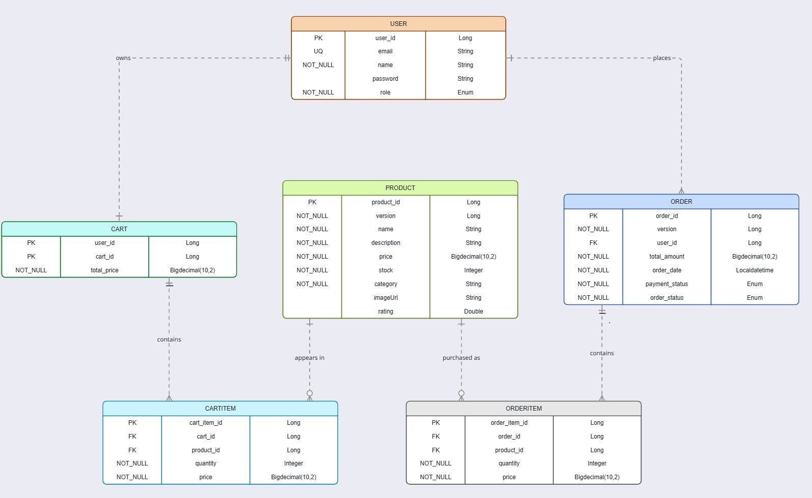
</p>


#  API Documentation

Access the interactive Swagger UI:

```
http://localhost:8080/swagger-ui/index.html
```

---

## API Documentation & Testing Guide

This section provides a comprehensive guide to the REST endpoints available in the system. Use these to test the complete flow from user registration to order fulfillment using tools like **Postman** or **Insomnia**.

---

###  1. Registration And Authentication
<details>
<summary>Click to expand Registration And Authentication APIs</summary>

#### **Register-Admin**
* **Method:** `POST`
* **URL:** `http://localhost:8080/api/users/register`

### API Screenshot
<p align="center">
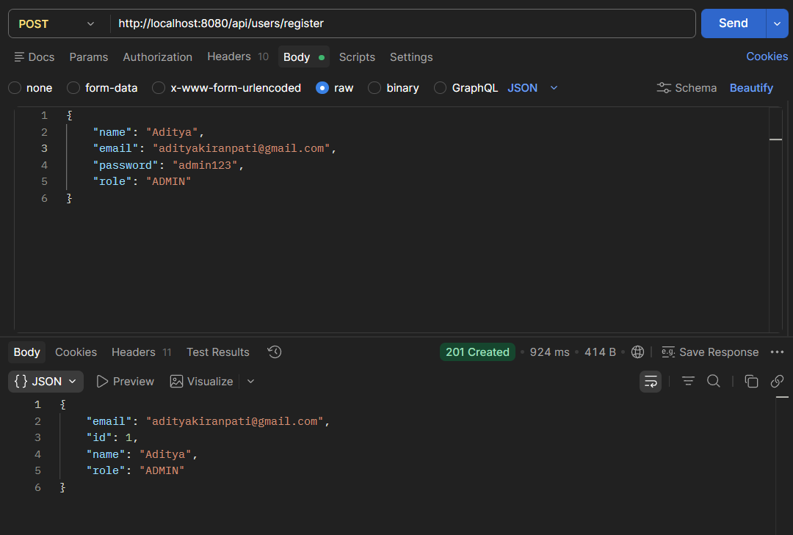
</p>

#### **Register-Customer**
* **Method:** `POST`
* **URL:** `http://localhost:8080/api/users/register`

###  API Screenshot
<p align="center">
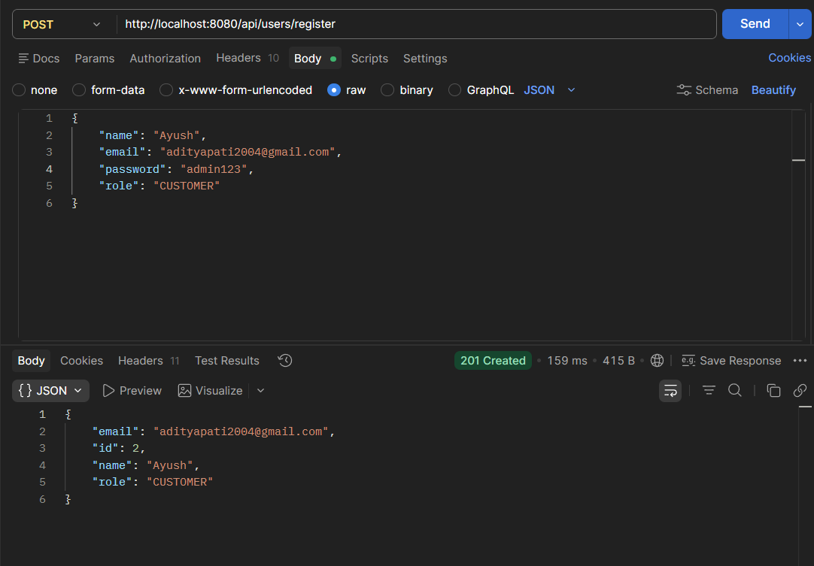
</p>

#### **Login-Admin**
* **Method:** `POST`
* **URL:** `http://localhost:8080/api/users/login`

###  API Screenshot
<p align="center">
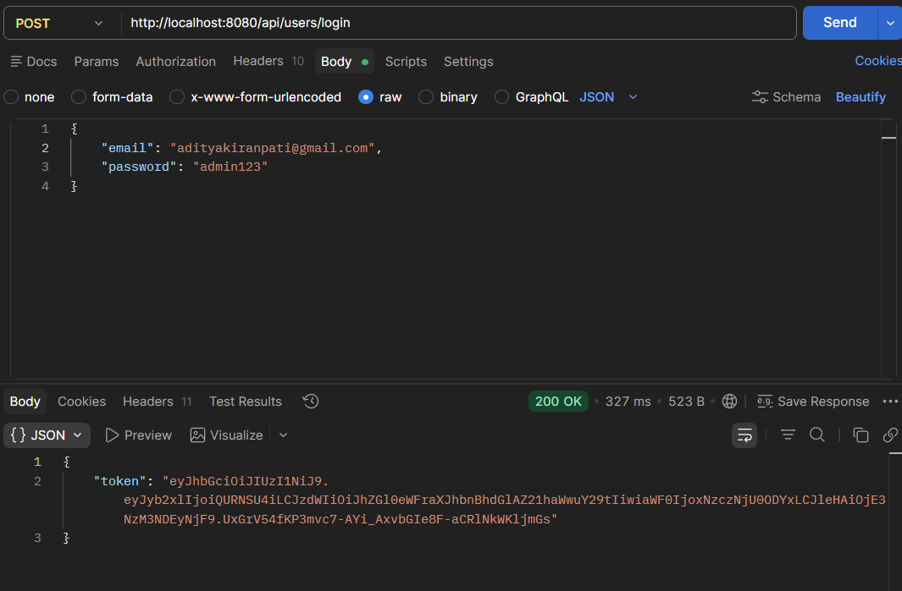
</p>

#### **Login-Customer**
* **Method:** `POST`
* **URL:** `http://localhost:8080/api/users/login`

###  API Screenshot
<p align="center">
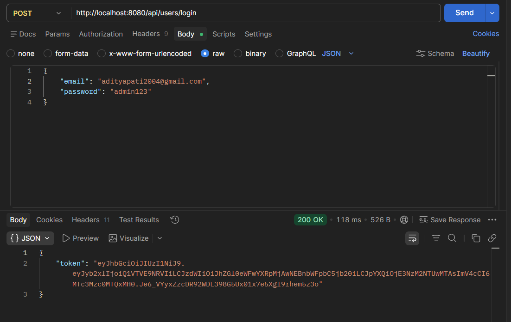
</p>
</details>

---

###  2. Products
<details>
<summary>Click to expand Products APIs</summary>

#### **Add-Product(Admin)**
* **Method:** `POST`
* **URL:** `http://localhost:8080/api/products`

###  API Screenshot
<p align="center">
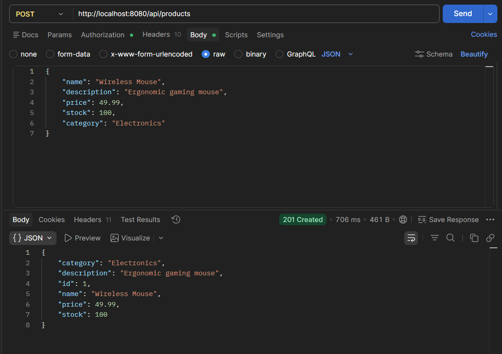
</p>

#### **Get-All-Products**
* **Method:** `GET`
* **URL:** `http://localhost:8080/api/products?page=0&size=10`

### API Screenshot
<p align="center">
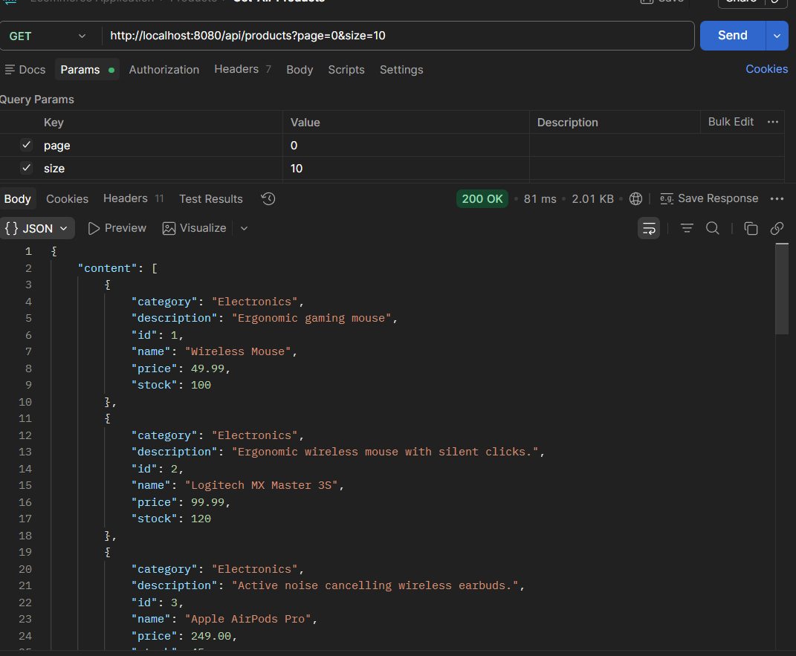
</p>

#### **Get-ProductById**
* **Method:** `GET`
* **URL:** `http://localhost:8080/api/products/{id}`

###  API Screenshot
<p align="center">
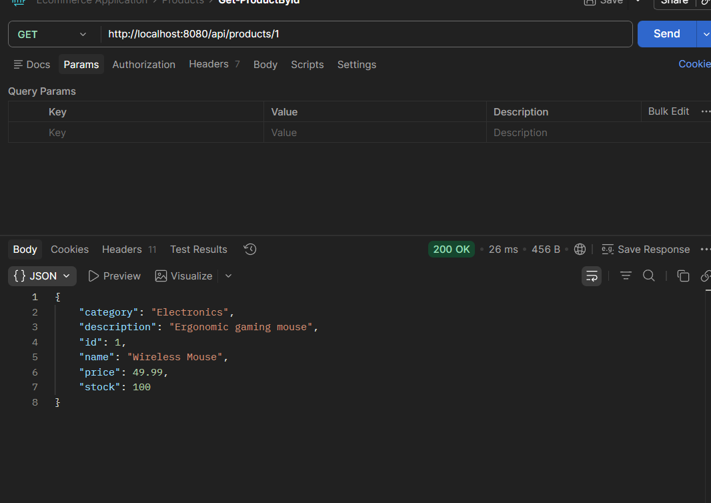
</p>

#### **Update-Product(By Admin)**
* **Method:** `PUT`
* **URL:** `http://localhost:8080/api/products/{id}`

###  API Screenshot
<p align="center">

</p>

#### **Delete-ProductById(By Admin)**
* **Method:** `DELETE`
* **URL:** `http://localhost:8080/api/products/{id}`

###  API Screenshot
<p align="center">

</p>
</details>

---

###  3. User
<details>
<summary>Click to expand User APIs</summary>

#### **Get-UserById**
* **Method:** `GET`
* **URL:** `http://localhost:8080/api/users/{id}`

###  API Screenshot
<p align="center">
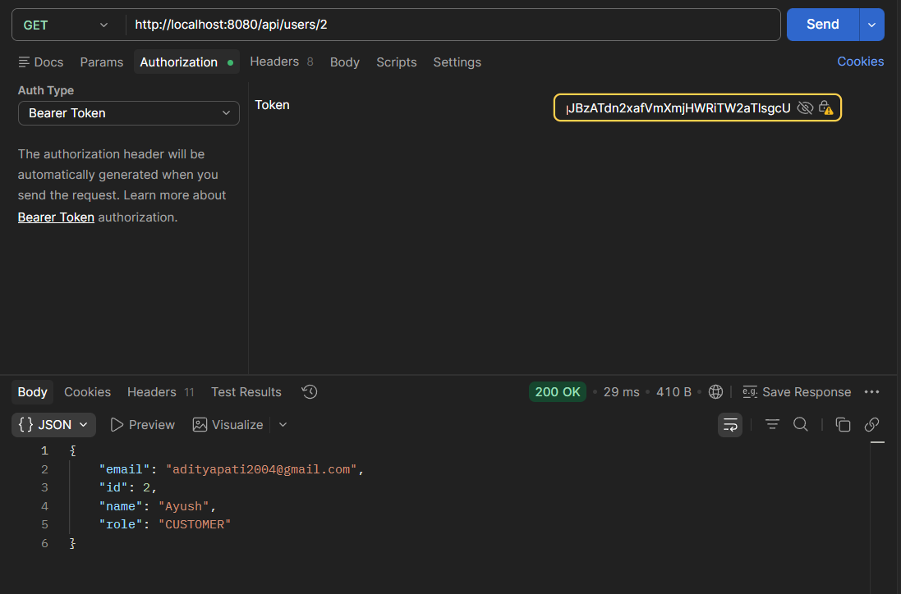
</p>

#### **Update-User(By Admin)**
* **Method:** `PUT`
* **URL:** `http://localhost:8080/api/users/{id}`

###  API Screenshot
<p align="center">

</p>

#### **Update-Customer(By Customer Itself)**
* **Method:** `PUT`
* **URL:** `http://localhost:8080/api/users/{id}`

###  API Screenshot
<p align="center">

</p>

#### **Delete-User(By Admin)**
* **Method:** `DELETE`
* **URL:** `http://localhost:8080/api/users/{id}`

###  API Screenshot
<p align="center">

</p>
</details>

---

###  4. Cart
<details>
<summary>Click to expand Cart APIs</summary>

#### **Add-ProductToCart**
* **Method:** `POST`
* **URL:** `/api/cart/add/{productId}?userId={id}&quantity={n}`

###  API Screenshot
<p align="center">
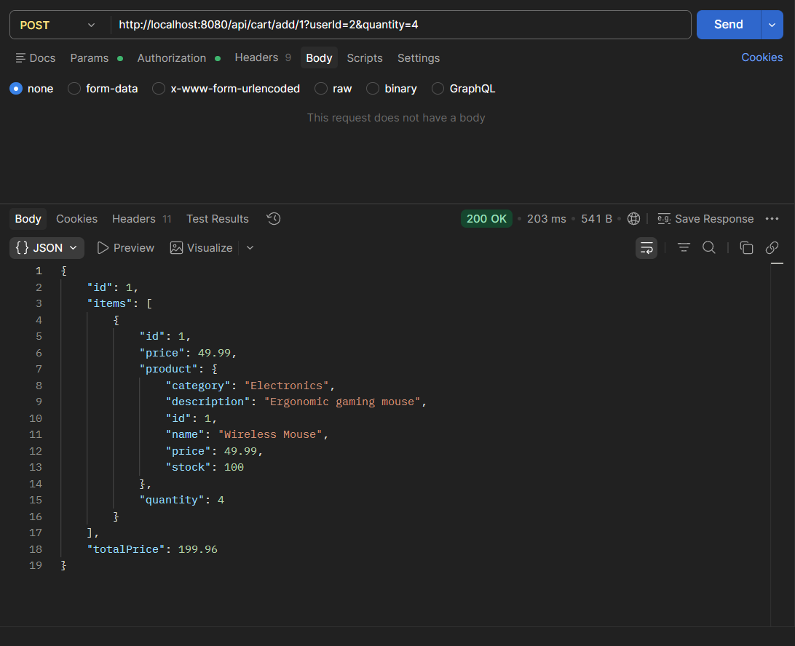
</p>

#### **Update-Cart**
* **Method:** `PUT`
* **URL:** `/api/cart/update/{productId}?userId={id}&quantity={n}`

###  API Screenshot
<p align="center">
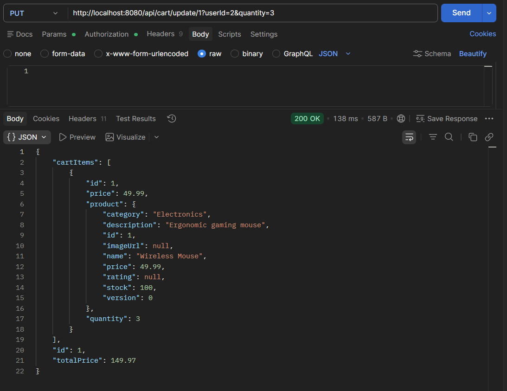
</p>

#### **Get-CartByUserId**
* **Method:** `GET`
* **URL:** `/api/cart?userId={id}`

### API Screenshot
<p align="center">
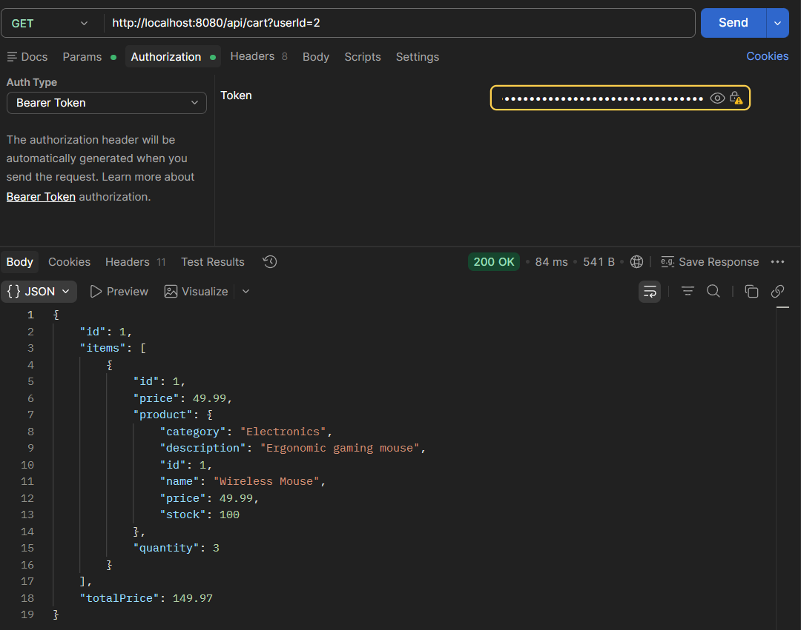
</p>

#### **Delete-FromCart**
* **Method:** `DELETE`
* **URL:** `/api/cart/remove/{productId}?userId={id}`

###  API Screenshot
<p align="center">

</p>
</details>

---

###  5. Order
<details>
<summary>Click to expand Order APIs</summary>

#### **Checkout-Order**
* **Method:** `POST`
* **URL:** `/api/orders/checkout?userId={id}`

### API Screenshot
<p align="center">
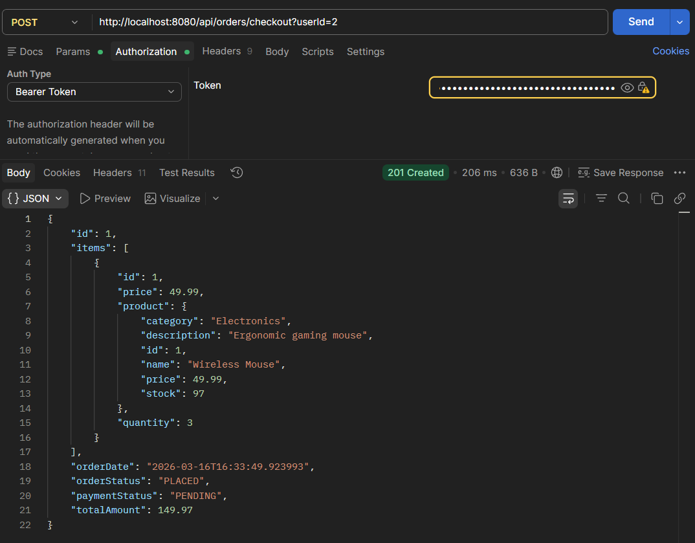
</p>

#### **Get-OrderHistory(By Customer)**
* **Method:** `GET`
* **URL:** `/api/orders?userId={id}`

###  API Screenshot
<p align="center">

</p>

#### **Get-OrderHistory(By Admin)**
* **Method:** `GET`
* **URL:** `/api/orders?userId={id}`

###  API Screenshot
<p align="center">

</p>

#### **Get-OrderById(By Customer)**
* **Method:** `GET`
* **URL:** `/api/orders/{orderId}?userId={id}`

###  API Screenshot
<p align="center">

</p>

#### **Get-OrderById(By Admin)**
* **Method:** `GET`
* **URL:** `/api/orders/{orderId}?userId={id}`

###  API Screenshot
<p align="center">

</p>

#### **Simulate-Payment(By Customer)**
* **Method:** `POST`
* **URL:** `/api/orders/{orderId}/pay?userId={id}&success=true`

###  API Screenshot
<p align="center">

</p>
</details>

---

## Additional Features & Optimizations

The system incorporates several enterprise-level features to enhance security, performance, scalability, and maintainability.

##### JWT-based Authentication
Authentication is implemented using **Spring Security with JSON Web Tokens (JWT)**.  
This ensures stateless session management, allowing the application to scale horizontally without maintaining server-side sessions.

##### Pagination and Sorting
Product listing APIs support **pagination and sorting** using Spring Data's `Pageable` interface.  
This reduces database load and improves network efficiency when handling large product catalogs.

##### ModelMapper and DTOs
The application uses **DTO (Data Transfer Object) patterns** with **ModelMapper** to separate internal entity models from API response objects.  
This prevents exposure of sensitive fields and ensures a clean and controlled API contract.

##### Unit Testing
Business logic and service layers are thoroughly tested using **JUnit 5** and **Mockito**.  
This ensures reliability, correctness, and maintainability of core application functionality.

##### Email Notifications
Order confirmation emails are automatically sent to customers after successful checkout using **Spring Boot Mail**.  
The email process runs asynchronously to avoid blocking the main application flow.

#####  Email Sample
<p align="center">
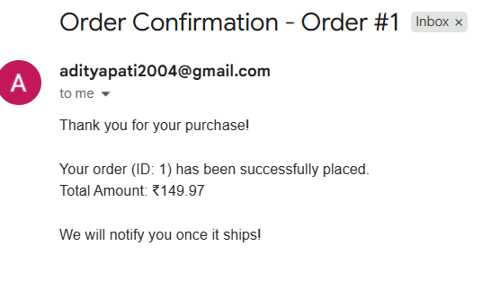
</p>

##### Swagger UI Documentation
The system integrates **Swagger UI** through **Springdoc OpenAPI**, providing interactive API documentation that allows developers to test endpoints directly from the browser.


##### Redis Inventory Management
The application leverages **Redis caching** to manage inventory checks and reservations efficiently.  
This significantly reduces database load and helps prevent overselling during high traffic.

---

###  Data Integrity & Financial Accuracy
* **Optimistic Locking (`@Version`):** Solves the "Lost Update" concurrency anomaly. If two customers attempt to buy the final stock of a single product simultaneously, Hibernate safely rolls one back via a version check, guaranteeing exact inventory integrity without locking the entire table.


* **BigDecimal Precision:** Uses `BigDecimal` for all price and total amount fields to eliminate floating-point arithmetic errors inherent to doubles/floats in financial transactions.


* **DTOs & ModelMapper:** Ensures the API only exposes necessary data. `ModelMapper` automatically translates nested JPA Entities into flat, clean JSON responses, preventing recursive mapping crashes.

---

##  Global Exception Handling (`@RestControllerAdvice`)

Instead of throwing messy Java stack traces back to the client, the application intercepts all errors via a centralized `@RestControllerAdvice` component. It maps exceptions to clean, standardized JSON `ErrorResponse` objects containing a timestamp, HTTP status, clear message, and the requested path.


**Key Exceptions Handled:**
1.  **`ResourceNotFoundException` (404 Not Found):** Triggered when querying a non-existent User, Product, Cart, or Order.


2.  **`ResourceAlreadyExistsException` & `DataIntegrityViolationException` (409 Conflict):** Handles duplicate entries, such as a user attempting to register with an email that already exists.


3.  **`BadRequestException` (400 Bad Request):** Catches business logic violations, such as attempting to checkout an empty cart or adding more items than are currently in stock.


4.  **`ObjectOptimisticLockingFailureException` (409 Conflict):** Caught during race conditions. Informs the user that another transaction modified the resource (e.g., inventory stock) since they last viewed it.


5.  **`MethodArgumentNotValidException` (400 Bad Request):** Intercepts DTO validation failures (e.g., blank fields or invalid emails) and returns a mapped list of specific field errors.


6.  **`AccessDeniedException` (403 Forbidden):** Triggered when a user attempts to access a resource that belongs to someone else, enforcing strict isolation.


7.  **`BadCredentialsException` (401 Unauthorized):** Handles invalid login attempts cleanly.

---

##  Testing the API (Using Postman)

The easiest way to test these endpoints is by using the pre-configured Postman Collection.

**Option 1: Local Import**
A standalone JSON file is included in the root directory of this project.
* **File:** [Ecommerce Application.postman_collection.json](./Ecommerce Application.postman_collection)
* **How to use:** Open Postman -> Click **Import** -> Select the file from the root folder.

---

###  How to Test
Follow these steps to ensure a successful testing flow:

1. **Set Environment:** Ensure your local server is running at `http://localhost:8080` (or `8082`).
2. **Authentication:** * Navigate to the **Authentication** folder in Postman.
   * Run the **Login** request.
   * Copy the `jwt-token` from the response.
3. **Authorization:** * In Postman, click on the **Collection Name** -> **Authorization** tab.
   * Set Type to **Bearer Token**.
   * Paste your token into the field. 
   * All requests in the collection will now automatically use this token.
4. **Sequencing:** Start with the **Product API** (Public), then move to **Cart**, and finally **Order**.

##  Testing & Code Coverage

The application logic is rigorously tested using **JUnit 5** and **Mockito** to ensure reliability and fault tolerance across the Controller and Service layers. Tests cover successful execution paths, edge cases, security constraints, and exception triggers.

###  JUnit 5 Test Execution Report
* **Total Tests Run:** 106


* **Tests Passed:** 106


* **Tests Failed:** 0


* **Tests Skipped:** 0


* **Execution Time:** ~9.34 seconds


###  JUnit Execution Results
<p align="center">
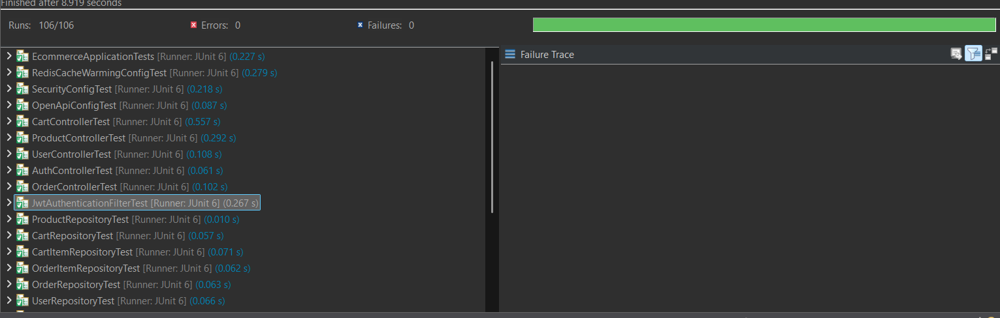
</p>


###  JaCoCo Test Coverage Report
The project maintains strict test coverage requirements to guarantee code quality. The detailed HTML report is generated via the Maven build lifecycle and stored in the `target/site/jacoco` directory.

**Overall Coverage Metrics:**
* **Instructions Coverage:** 80% (2,741 of 3,407 covered)


* **Branch Coverage:** 82% (61 of 74 covered)


* **Cyclomatic Complexity Covered:** 266 of 347


* **Methods Covered:** 241 of 310


**Key Package Coverage Breakdown:**
* **`com.ecommerce.config`:** 100% Instruction Coverage / 100% Branch Coverage


* **`com.ecommerce.controller`:** 99% Instruction Coverage


* **`com.ecommerce.utils`:** 98% Instruction Coverage


* **`com.ecommerce.filter`:** 94% Instruction Coverage / 100% Branch Coverage


* **`com.ecommerce.serviceImpl`:** 93% Instruction Coverage / 84% Branch Coverage


* **`com.ecommerce.entity`:** 92% Instruction Coverage


###  JaCoCo HTML Report
<p align="center">
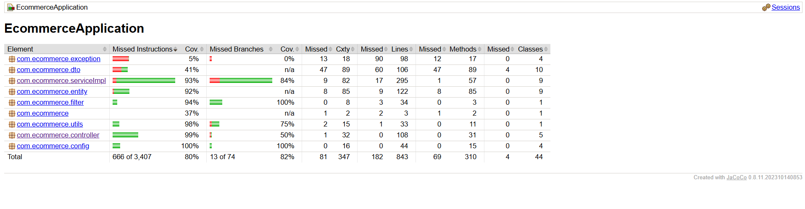
</p>

---

## Docker Execution (Containerized)

This is the fastest way to run the entire application stack — including the **database, cache, backend service, and database management tool** — using a single command.

---

### 1. Prerequisites

Ensure the following software is installed and running on your system:

- Docker Desktop

---

### 2. Launch the Stack

Navigate to the **project root directory** and run the following command:

```bash
docker-compose up -d
```


